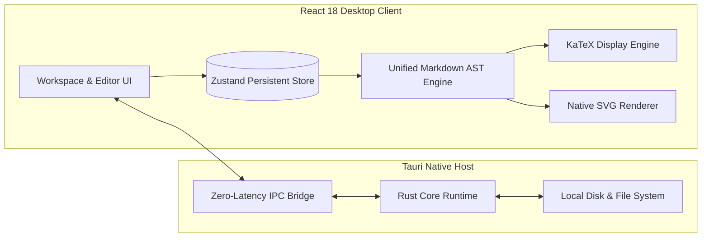

```markdown
<p align="center">
  
</p>

<div align="center">

# Harpa — AI Synthesis Binder

**A local-first research cockpit and publication binder for AI-assisted minds.**  
*Compile messy LLM derivations, complex KaTeX formulas, vector diagrams, and source code into archival-grade A4 research volumes.*

[](https://github.com/Velocity07/Harpa/releases)
[](https://tauri.app)
[](https://react.dev)
[](https://katex.org)
[](LICENSE)

</div>

---

## The Philosophy

Modern AI models excel at generating rich technical output: multi-variable tensor equations, Mermaid architecture diagrams, code implementations, and comparative benchmarks. 

Standard note-taking applications break this output:
* Google Docs mangles LaTeX and scrambles indentation.
* Notion and web tools clip wide tables and rasterize diagrams into low-resolution images.
* Standard browser print engines slice code blocks in half across page margins.

**Harpa** is an indie, local-first synthesis cockpit engineered to bridge this gap. It captures raw, unstructured AI output and lets you curate, restructure, and export it into publication-grade multi-chapter A4 documents without layout degradation.

---

## Core Capabilities

### ⚡ Rapid-Ingest Pipeline
Capture thoughts without breaking focus. Paste raw AI Markdown directly into the fast-ingestion buffer and press `Ctrl + Enter`. Harpa parses code fences, math blocks, and vector strings into indexed research cards instantly.

### 📐 Uncompromising Mathematical Typography
Powered by an isolated KaTeX rendering engine. Complex tensor equations, matrix operators ($\mathbf{W}_p \in \mathbb{R}^{d \times k}$), multi-line derivations, and limit notations render with textbook-level typography without clipping or collapsing into prose.

### 📊 Pure Vector Diagramming
Embedded Mermaid flowcharts and system topologies render as native vector SVG paths and pure text nodes. When printed or exported to PDF, diagrams remain sharp at any zoom level without `<foreignObject>` PDF export clipping.

### 📖 Publication-Grade Book Engine
A dedicated multi-chapter compilation layout engineered specifically for print:
* **Automated Front-Matter:** Generates formal Cover Pages and dynamic Tables of Contents with chapter metrics.
* **Orphan-Resistant Pagination:** Custom `@media print` rules prevent Chromium from slicing code blocks, matrices, or diagram cards across page breaks.
* **Editorial Themes:** Switch between Ivory Parchment, Minimalist Editorial Serif, and Slate Monochrome with unified typography.

### 🔒 100% Local-First & Zero Telemetry
Your research stays yours. Harpa runs entirely offline using a lightweight Tauri (Rust) shell and local disk persistence. No remote databases, no tracking pixels, and no vendor lock-in. Back up or restore your entire library as raw JSON or standard Markdown at any time.

---

## Installation (Windows)

Pre-compiled standalone binaries are available on the [Releases](https://github.com/Velocity07/Harpa/releases) page.

1. Download **`Harpa_1.0.1_x64-setup.exe`** from the latest release.
2. Run the installer to set up Harpa on your machine.
3. Launch Harpa from your Start Menu.

> **Note on Windows SmartScreen:**  
> Because Harpa is an independent release without an EV code signing certificate, Windows Defender SmartScreen may display an *"Unrecognized app"* notice. Click **More info** → **Run anyway** to proceed.

---

## Architecture & Tech Stack



* **Desktop Host:** [Tauri](https://tauri.app) (Rust runtime; sub-40MB memory footprint).
* **UI Layer:** React 18, TypeScript, Tailwind CSS, Lucide Icons.
* **State Management:** Zustand with local disk persistence and non-blocking indexing.
* **AST & Processing:** Remark/Rehype AST pipelines, Prism syntax highlighting, KaTeX, and native Mermaid SVG rendering.

---

## Building from Source

### Prerequisites

* [Node.js](https://nodejs.org/) (v18 or newer)
* [Rust & Cargo](https://rustup.rs/) (v1.75 or newer)
* C++ Build Tools for Windows (via Visual Studio Installer)

### Development Setup

```bash
# 1. Clone the repository
git clone [https://github.com/Velocity07/Harpa.git](https://github.com/Velocity07/Harpa.git)
cd Harpa

# 2. Install dependencies
npm install

# 3. Launch desktop app in development mode
npm run tauri dev

```

### Production Packaging

To compile an optimized native `.exe` installer:

```bash
npm run tauri build

```

The compiled installer will be generated in `src-tauri/target/release/bundle/nsis/`.

---

## License

Distributed under the **GNU Affero General Public License v3 (AGPLv3)**. See [`LICENSE`](LICENSE) for details. Built to remain open, transparent, and resilient.
